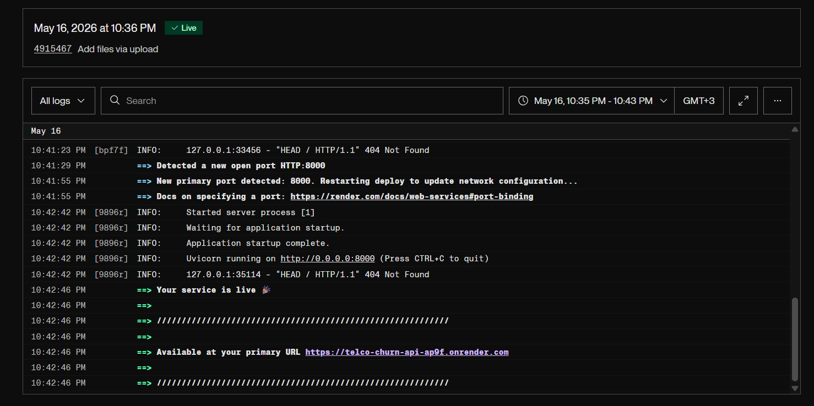
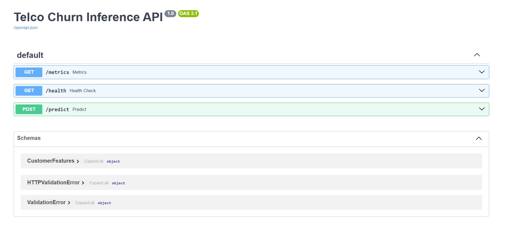
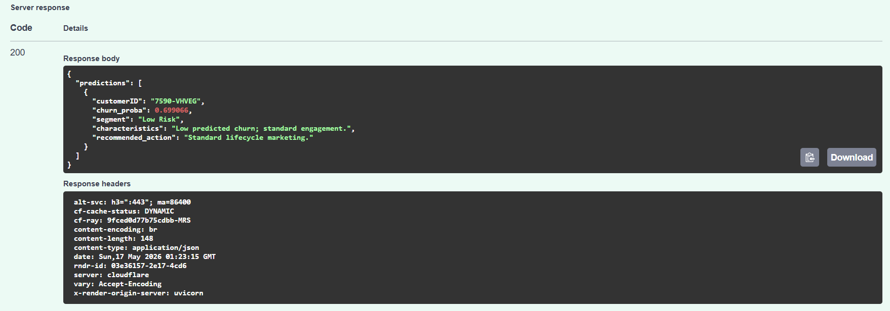

# Telco Customer Churn Prediction: End-to-End MLOps Production Service

Production-ready telco churn prediction system built for an MLOps project. This repository folder contains the runnable FastAPI service, the serialized inference pipeline, the dataset used by the service, and the containerization files needed for deployment.

## Project Summary

Telecom churn is expensive because each lost customer reduces recurring revenue and increases acquisition pressure. This project turns a churn classifier into a production-style machine learning service that can score individual customers in real time and support retention teams with actionable business segments.

The emphasis is on engineering quality rather than only model accuracy:
- reproducible data preparation
- leakage-aware preprocessing
- controlled handling of class imbalance with SMOTE
- model comparison and selection
- API serving with schema validation
- containerization with a non-root runtime
- operational monitoring and health checks
- deployable artifact packaging

## Business Problem

Telecom companies need to identify customers who are likely to leave before the cancellation happens. A reliable churn service lets retention teams intervene early with targeted offers, service recovery, or onboarding support.

The model is designed to answer:
- Who is at risk of churning?
- How confident is the model?
- Which retention action should be recommended?

## Dataset

The project uses the public Telco Customer Churn dataset with customer profile, subscription, billing, and service usage features.

Important data issues addressed during validation:
- `TotalCharges` contains hidden blank strings for some newly registered customers with `tenure = 0`.
- Those blank values are coerced to numeric `0.0` so the pipeline remains stable.
- `customerID` is a non-predictive identifier and is removed before training.
- The target variable is highly imbalanced, with many more retained customers than churned customers.

## Modeling Approach

The training workflow compares baseline and improved models before selecting a final champion pipeline.

Key decisions:
- baseline models included Logistic Regression and Decision Trees
- ensemble models such as Random Forest were evaluated for comparison
- SMOTE was applied only to the training split to avoid leakage into validation or test sets
- the final champion was a SMOTE-enhanced Logistic Regression model because it balanced F1 score, interpretability, and low inference cost

The final serialized artifact used by the API is:
- `churn_inference_pipeline.joblib`

## Reproducible Preprocessing Pipeline

All transformations are encapsulated in a single scikit-learn pipeline so training and serving use the same preprocessing logic.

Pipeline behavior:
- numerical features are standardized with scaling
- categorical features are one-hot encoded
- missing or malformed numeric values are normalized before inference
- the model receives the same schema during training and production serving

This reduces training-serving skew and makes artifact reuse safe across environments.

## API Service

The production service is implemented with FastAPI in `app.py`.

### Endpoints

- `POST /predict` - accepts a batch of customer records and returns churn predictions plus business segments
- `GET /health` - returns service health, timestamp, CPU usage, memory usage, and available memory
- `GET /metrics` - exposes Prometheus metrics for HTTP traffic, system usage, and model-level prediction counts

### Prediction Output

Each prediction includes:
- `customerID`
- `churn_proba`
- `segment`
- `characteristics`
- `recommended_action`

### Business Segments

The API assigns customers to one of four retention-oriented segments:
- High-Value Flight Risk
- New-Customer Flight Risk
- Mid-Risk Retention Opportunity
- Low Risk

These segments convert raw probabilities into business actions that retention teams can use directly.

## Monitoring and Observability

The API is instrumented with Prometheus and system-level telemetry.

Tracked metrics include:
- request counts and request errors
- HTTP latency and throughput
- CPU and memory usage
- churn vs. no-churn prediction totals

Observed drift signal:
- a major shift in the prediction distribution can be used as an early indicator of data drift or concept drift

## Containerization

The service is packaged as a production-style Docker image with security and size controls.

Container design:
- multi-stage build
- `python:3.10-slim` base image
- non-root runtime user `appuser` with UID 1000
- health check on `/health`
- FastAPI served with Uvicorn on port `8000`

## Live Deployment

The service is deployed on Render and available at:

- `https://telco-churn-api-ap9f.onrender.com`

Useful paths:
- API root: `https://telco-churn-api-ap9f.onrender.com`
- Docs: `https://telco-churn-api-ap9f.onrender.com/docs`
- Health: `https://telco-churn-api-ap9f.onrender.com/health`
- Metrics: `https://telco-churn-api-ap9f.onrender.com/metrics`

## Project Structure

```text
GitHub/
├── README.md
├── app.py
├── churn_inference_pipeline.joblib
├── Dockerfile
├── requirements.txt
├── test_api.py
├── load_churn_model.executed.ipynb
├── telco_churn_mlop_checks.ipynb
└── WA_Fn-UseC_-Telco-Customer-Churn.csv
```

## Quick Start

### 1. Create and activate the virtual environment

From the `GitHub/` folder:

```powershell
python -m venv .venv
.\.venv\Scripts\Activate.ps1
```

If the environment already exists, activate it instead of recreating it.

### 2. Install dependencies

```powershell
pip install -r requirements.txt
```

### 3. Run the API locally

```powershell
uvicorn app:app --host 0.0.0.0 --port 8000
```

Open these URLs after startup:
- API docs: `http://localhost:8000/docs`
- Health: `http://localhost:8000/health`
- Metrics: `http://localhost:8000/metrics`

## Example Prediction Request

`POST /predict` expects a JSON array of customer objects.

```bash
curl -X POST http://localhost:8000/predict ^
  -H "Content-Type: application/json" ^
  -d "[
    {
      \"customerID\": \"7590-VHVEG\",
      \"gender\": \"Female\",
      \"SeniorCitizen\": 0,
      \"Partner\": \"Yes\",
      \"Dependents\": \"No\",
      \"tenure\": 12,
      \"PhoneService\": \"Yes\",
      \"MultipleLines\": \"No\",
      \"InternetService\": \"DSL\",
      \"OnlineSecurity\": \"No\",
      \"OnlineBackup\": \"Yes\",
      \"DeviceProtection\": \"No\",
      \"TechSupport\": \"No\",
      \"StreamingTV\": \"No\",
      \"StreamingMovies\": \"No\",
      \"Contract\": \"Month-to-month\",
      \"PaperlessBilling\": \"Yes\",
      \"PaymentMethod\": \"Electronic check\",
      \"MonthlyCharges\": 29.85,
      \"TotalCharges\": 346.45
    }
  ]"
```

Example response:

```json
{
  "predictions": [
    {
      "customerID": "7590-VHVEG",
      "churn_proba": 0.699066,
      "segment": "Mid-Risk Retention Opportunity",
      "characteristics": "Moderate predicted churn - good candidates for targeted offers.",
      "recommended_action": "Nudge campaigns: time-limited promotions, bundle suggestions, service checks."
    }
  ]
}
```

## Health Endpoint

`GET /health` returns:
- `status`
- `timestamp`
- `cpu_percent`
- `memory_percent`
- `memory_available_mb`

This makes the endpoint useful for container and load balancer health checks.

## Metrics Endpoint

`GET /metrics` exposes telemetry that can be scraped by Prometheus.

Useful metrics:
- `churn_predictions_total{prediction_class="churn"}`
- `churn_predictions_total{prediction_class="no_churn"}`
- `prediction_requests_total`
- `prediction_errors_total`
- `cpu_usage_percent`
- `memory_usage_percent`
- HTTP request latency and request count metrics from `prometheus-fastapi-instrumentator`

## Docker Usage

The production Dockerfile is stored in `Dockerfile`.

### Build

```bash
docker build -t telco-churn-api:latest .
```

### Run

```bash
docker run --rm -p 8000:8000 telco-churn-api:latest
```

## Testing

A lightweight API test script is available at `test_api.py`.

Recommended checks:
- start the API
- open `/docs`
- send a sample batch payload to `/predict`
- verify `/health` returns system metrics
- verify `/metrics` exposes Prometheus-formatted output

## Deployment Notes

The project is structured for deployment to a managed cloud platform with CI/CD tied to GitHub.

Typical production flow:
- build the Docker image
- push the image to a container registry
- deploy the image to the hosting platform
- expose `/health` for readiness checks
- scrape `/metrics` for monitoring dashboards and alerts

## Screenshots

- Docker build or CI/CD logs


- successful Swagger UI prediction on `/docs`



## Notes and Constraints

- The API expects the Telco feature schema used in the training pipeline.
- `TotalCharges` is normalized to numeric and blank strings are treated as missing values.
- Batch prediction is supported, so the request body should be a JSON list.
- The model artifact and reference dataset are loaded at startup for inference and business segmentation.

## Conclusion

This project demonstrates the full MLOps lifecycle for a churn prediction service: data validation, reproducible preprocessing, imbalance handling, model selection, containerization, API serving, and observability. The result is a production-style ML application that is ready for local testing, container deployment, and operational monitoring.
